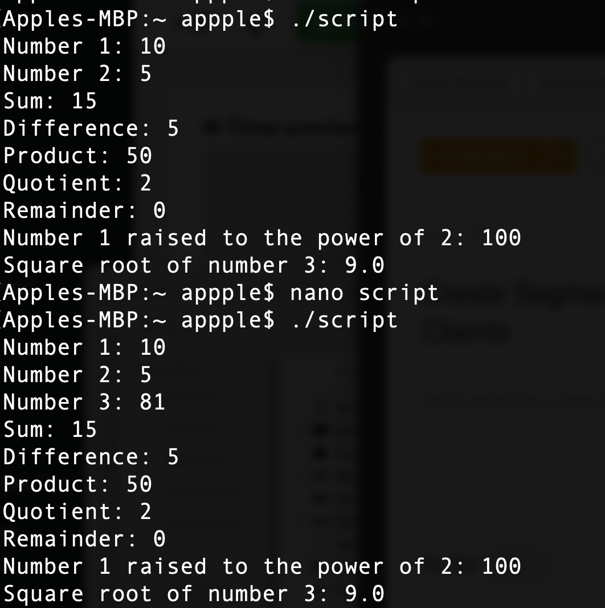

# Introduction to Shell Scripting and User Input

In the past weeks we have been able to understand and work with some of the basic commands that are availble in Linux Shell.

As a DevOps Engineer, we will start to write some complex shell scripts which will require us putting it all together, and ofcourse the ultimate goal is not to babysit our scripts rather make it work on it's own (Automation) as if someone was there controllin it.

Another way we could look at it is that assuming you need to do repeatitive task(s), then writing a script might be a better way of doing it rather than manually repeating yourself. 

## Shell Scripting Syntax Element

### 1. Variables

Bash allows you to define variables. Variables can store different types of data, including, Integer, float, String, and Array

We can assign values to variables with the `=` symbol, while accessing the value of the variable using the `$` symbol

Example:

```
name="Buhari"
```

Retriving the value stored in name,

echo "We love $name"

Output


## Control Flow

In bash scripting and most programming languages, we use the concept of `flow control` to control how the program executes or execution based on user input. You can iterate over lists, execute different commands based on condition

`if condition` `if-else` `while` `case` `for` 

#!/bin/bash

# Example script to check if a number is positive, negative, or zero

read -p "Enter a number: " num

if [ $num -gt 0 ]; then
    echo "The number is positive."
elif [ $num -lt 0 ]; then
    echo "The number is negative."
else
    echo "The number is zero."
fi

## While loop that outputs 1-10 with an interval of 1 sec

#!/bin/bash

counter=1

while [ $counter -le 10 ]
do
    echo $counter
    counter=$(( $counter + 1 ))
    sleep 1

done

Output


## Command Substitution

Command substitution allows you to capture the output of a command and use it as a value in your script

Example

current_date=`date +%Y-%m-%d`

Also using the $( ) is another command substitution 

current_date=$(date +%Y-%m-%d)

Output


## Input and Output

We can also get or accept input from the user in the shell and based on these make our script more dynamic.

We used the `read` command to accept values/input from the user

Example

```
read -p "What is your name? " name

echo "Welcome, $name"

```


## Out the result of a command into a file

echo "Welcome to my first folder file" > Welcome.txt

## Pass the content of a file as an input to a command

grep "pattern" < input.txt

## Pass the result of a command as an input to another command

echo "Helo world" | grep "pattern"

Output


## Function


# Directory Manipulation and Navigation

The script below will display your current directory using the $PWD command, creates a new directory called my_directory and changing into the newly created directory and printing the new working directory

Create 2 text files using the touch command, then list the `ls` list storage


```
#!/bin/bash

# Display current directory
echo "Current directory: $PWD"

# Create a new directory
echo "Creating a new directory..."
mkdir my_directory
echo "New directory created."

# Change to the new directory
echo "Changing to the new directory..."
cd my_directory
echo "Current directory: $PWD"

# Create some files
echo "Creating files..."
touch file1.txt
touch file2.txt
echo "Files created."

# List the files in the current directory
echo "Files in the current directory:"
ls

# Move one level up
echo "Moving one level up..."
cd ..
echo "Current directory: $PWD"

# Remove the new directory and its contents
echo "Removing the new directory..."
rm -rf my_directory
echo "Directory removed."

# List the files in the current directory again
echo "Files in the current directory:"
ls

```


# File Operations and Sorting

In the script below will be creating 3 files (file1.txt,file2.txt,file3.txt) 


#!/bin/bash

## Create three files
echo "Creating files..."
echo "This is file3." > file3.txt
echo "This is file1." > file1.txt
echo "This is file2." > file2.txt
echo "Files created."

## Display the files in their current order
echo "Files in their current order:"
ls

## Sort the files alphabetically
echo "Sorting files alphabetically..."
ls | sort > sorted_files.txt
echo "Files sorted."

## Display the sorted files
echo "Sorted files:"
cat sorted_files.txt

## Remove the original files
echo "Removing original files..."
rm file1.txt file2.txt file3.txt
echo "Original files removed."

## Rename the sorted file to a more descriptive name
echo "Renaming sorted file..."
mv sorted_files.txt sorted_files_sorted_alphabetically.txt
echo "File renamed."

## Display the final sorted file
echo "Final sorted file:"
cat sorted_files_sorted_alphabetically.txt

Output


# Working with numbers and Calculations

The script below shows how to use the basic mathematical functions and calculations to achieve a better level of scripting

#!/bin/bash

# Define two variables with numeric values
num1=10
num2=5

# Perform basic arithmetic operations
sum=$((num1 + num2))
difference=$((num1 - num2))
product=$((num1 * num2))
quotient=$((num1 / num2))
remainder=$((num1 % num2))

# Display the results
echo "Number 1: $num1"
echo "Number 2: $num2"
echo "Sum: $sum"
echo "Difference: $difference"
echo "Product: $product"
echo "Quotient: $quotient"
echo "Remainder: $remainder"

# Perform some more complex calculations
power_of_2=$((num1 ** 2))
square_root=$(awk "BEGIN{ sqrt=$num2; print sqrt }")

# Display the results
echo "Number 1 raised to the power of 2: $power_of_2"
echo "Square root of number 2: $square_root"


Output




# File Backup and Manipulation

#!/bin/bash

# Define the source directory and backup directory
source_dir="/Users/appple/scripts"
backup_dir="/Users/appple/backup"

# Create a timestamp with the current date and time
timestamp=$(date +"%Y%m%d%H%M%S")

# Create a backup directory with the timestamp
backup_dir_with_timestamp="$backup_dir/backup_$timestamp"

# Create the backup directory
mkdir -p "$backup_dir_with_timestamp"

# Copy all files from the source directory to the backup directory
cp -r "$source_dir"/* "$backup_dir_with_timestamp"

# Display a message indicating the backup process is complete
echo "Backup completed. Files copied to: $backup_dir_with_timestamp"

Output

